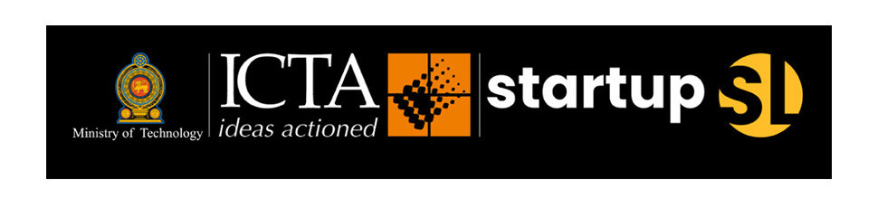

## ‘StartupSL.lk’ exceeds 400 startup registrations

The platform which was developed by targeting technology startups in Sri Lanka, ‘StartupSL.lk’ website has exceeded 400 startup registrations, said Programme Head of Industry Development, Information and Communication Technology Agency (ICTA) in Sri Lanka, Sachindra Samararathne.

He said currently, this website has startups registered under more than 40 business categories including agri-tech, artificial intelligence, robotics, e-commerce, software and hardware. Visitors and users of this website are facilitated to search and contact these startups based on business category, startup stage, funding stage and date of registration according to their needs. Various local and foreign parties are using this website, for search and contact startups and also some are using it as a source of information for analysing startups in Sri Lanka.

“This website has been launched with the aim of bringing Sri Lankan startups, investors and other professional organisations into a single platform to empower entrepreneurs. Also there are several volunteer organisations that are collaborating and supporting this measure. The Finance Ministry has mandated that tenders for all Government software contracts costing less than Rs two million should be directed to these startups,” said Samararathne.

In 2019, the then Ministry of Digital Infrastructure and Information Technology has initiated this Startup Sri Lanka and is currently being operated together with ICTA. By the end of 2020, we had 350 registrations and now it has 409 registrations, he added.

This platform is the single largest online platform for startups and freelancers in Sri Lanka, which connects them to thousands of other startups as well as other key stakeholders such as investors, mentors and incubators. A steering committee has been set up including members from ICTA, startup community and some other Government institutions. This committee is working together to support the tech community and accelerate the growth of Sri Lankan startups and freelancers.

The website is maintained and administrated by ICTA, according to the guidance given by the Ministry of Technology. The Secretary of Ministry of Technology, Jayantha De Silva stated that providing new business opportunities and digital infrastructure for these startups is the top priority of the Ministry of Technology and this programme has become a huge support for achieving that. 

Samararathne said registration is offered free for  startup founders and by registering, they are privileged to get many benefits such as accreditation, partnership opportunities with various professional bodies and organisation, special financial schemes, and market access opportunities facilitated by ICTA. 

He further said according to the mandate of the Ministry of Finance, tenders for State software contracts costing less than Rs two million should be directed to startups registered on this platform. Secretaries to Ministries, State Ministries, Chief Secretaries of  Provincial Councils, Heads of Departments and District Secretaries, Heads of local Government authorities, Chairmen of Corporations, Statutory Boards and Chairmen of State owned enterprises have been informed in this regard. 

The Founder of Digital Pulz (Pvt.) Ltd, Koliya Pulasinghe said free cloud credits offering they received to fulfil their technology needs was a tremendous support during the pandemic. This offering of free AWS cloud credits for startups registered here carried out by collaborating with Amazon Web Services organisation. Application for various awards and competitions are facilitated through the same registration of the StartupSL.lk website.

Samararathne added that those registered will get additional benefits such as visibility for their startups or product and investors and other stakeholders who can support their growth. Also, they will be given facilities to share and mutually benefit as the startup community will face difficulty at the inception. To find solutions as a community for projected economic downtime, USD 1,000 free credit will be offered by Amazon Web Services for registering.

In addition, this will benefit the country as this is the only portal with all start-ups being registered by level of maturity, industry vertical serving and will enable information for decision-makers. 

Special finance schemes such as government concessions, loans, grants and future tax holidays as well as other tax benefits will be available for startups and government-led venture capital schemes could be accessed.

Startup Sri Lanka will have partnerships with various professional bodies in Sri Lanka and overseas, where the Sri Lankan startup ecosystem could benefit from the links in terms of expanding their business within the country and outside. This will give information and subsidized rates to expand outside Sri Lanka. 

‘All technology startups in Sri Lanka are invited to register with us at www.startupsl.lk portal and registered startups will be given priority when considering benefits extended by the Government,” he said.

Source : https://ceylontoday.lk/news/concessions-aplenty-for-registered-startups-startupsl-lk-exceeds-400-startup-registrations-icta-head

