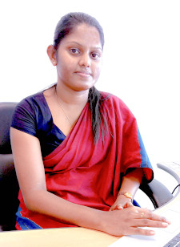

# නිලධාරීන්

## තාක්ෂණ ඇමති

 
**අතිගරු ජනාධිපති ගෝඨාභය රාජපක්ෂ මැතිතුමා**  
ශ්‍රී ලංකා ප්‍රජාතාන්ත්‍රික සමාජවාදී ජනරජයේ 7 වැනි විධායක ජනාධිපතිවරයා

## ලේකම්

 
**ජයන්ත ද සිල්වා** 
ලේකම් - තාක්ෂණ අමාත්යාංශය 
ලේකම් - ඩිජිටල් තාක්‍ෂණ සහ ව්‍යවසාය සංවර්ධන රාජ්‍ය අමාත්‍යාංශය

## අතිරේක ලේකම්වරු

|                                      |                                        |
| :-----------------------------------------------------------------------: | :-------------------------------------------------------------------------: |
| **එම් සී එල් රුද්‍රිගු මහතා**    අතිරේක ලේකම් (සංවර්ධන) | **අලවත්ත මහතා ඒ.කේ.ආර්**  අතිරේක ලේකම් (පරිපාලන) |

 

## මාණ්ඩලික නිලධාරීන්

|    |   |    |    |
| - | - | - | - |
|  **දිලීපා රත්නායක මිය**  ප්‍රධාන මූල්‍ය නිලධාරී |  **උදයරාජන් ආරුමුගම් මහතා**   ප්‍රධාන අභ්‍යන්තර විගණක  |  **එල්.එම්.ඩී පද්මකුමාරි මිය**  ප්‍රධාන ගණකාධිකාරී  |  **හිරණ්‍ය සමරසේකර මහතා**  ප්‍රධාන උපදේශක - තාක්ෂණ අමාත්‍යාංශය   Former CTO at ICTA  |

## පරිපාලන සහ කළමනාකරණ කණ්ඩායම

 
**ආර්.ඒ.එස්.අයි. රාජපක්ෂ මහත්මිය** 
ගණකාධිකාරී 