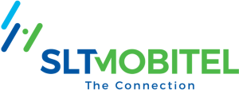

# ශ්‍රී ලංකා ටෙලිකොම් මොබිටෙල් (SLTMobitel)

ශ්‍රී ලංකා ටෙලිකොම් (SLT) යනු ජාතික තොරතුරු හා සන්නිවේදන තාක්ෂණ (ICT) විසඳුම් සපයන්නා වන අතර ශ්‍රී ලංකාවේ ප්‍රමුඛතම බ්‍රෝඩ්බෑන්ඩ් සහ යටිතල පහසුකම් සේවා සපයන්නා වේ. වසර 163 කට වැඩි කාලයක් මෙම සමාගම ස්ථාවර, ජංගම සහ අනෙකුත් මෙහෙයුම් අංශවල ක්‍රියාත්මක වන සම්බන්ධතාවයන් සඳහා ජාතික අවශ්‍යතාවයට අනුකූලය සේයා සැපයීම් සිදු කරයි. SLT සිය අධිවේගී තන්තු, තඹ සහ රැහැන් රහිත ප්‍රවේශ ජාලයන් හරහා දිවයිනේ මිලියන නවයකට අධික පාරිභෝගිකයින්ගේ අවශ්‍යතා ඉටු කරන අතර නවීන තාක්ෂණික පරිවර්තනයන්ට සමාගම ඩිජිටල් සේවා සපයන්නෙකු බවට පරිවර්තනය වීම මගින් විදුලි සංදේශ සේවාවලින් ඔබ්බට ගමන් කරමින්, ඩිජිටල් ජීවන රටාවකට ගැලපෙන විවිධ සේවාවන් සහ විසඳුම් සැපයීම් සිදු කරමින් පවතී. ජාත්‍යන්තර සබ්මැරීන් කේබල් පද්ධති හරහා ශ්‍රී ලංකාව ලෝකයට සම්බන්ධ කරමින් ශ්‍රී ලංකා ටෙලිකොම් ප්‍රධාන ගෝලීය සබඳතා සපයන්නෙකු ලෙස ස්ථානගත වී ඇත.

ශ්‍රී ලංකා ටෙලිකොම් (“SLT”) සමූහය නවීන තාක්‍ෂණයන් තුළින් විවිධාංගීකරණය වූ සේවා සහ පුළුල් පරාසයක තොරතුරු සන්නිවේදන තාක්ෂණ විසඳුම් සිය  පාරිභෝගිකයන් වෙත සපයයි. මේවා ස්ථාවර සහ ජංගම දුරකථන, බ්‍රෝඩ්බෑන්ඩ්, දත්ත සේවා, අන්තර්ජාල රූපවාහිනිය (IPTV), CLOUD පරිගණක සහ සත්කාරක සේවා සහ ජාලකරණ විසඳුම් ආවරණය කරයි. ශ්‍රී ලංකා  ටෙලිකොම් හි ප්‍රාථමික උපාය මාර්ගික කොටස් වන්නේ:
- ස්ථාවර ICT මෙහෙයුම්
- ජංගම ICT මෙහෙයුම්
- අනෙකුත් අංශ මෙහෙයුම්
2020 දී SLT සමූහයේ ආදායමෙන් 98%ක්, මුළු වත්කම්වලින් 98%ක් සහ ප්‍රාග්ධන වියදම්වලින් 97%ක් සාමූහිකව දරනු ලබන ප්‍රධාන ව්‍යාපාරය ස්ථාවර සහ ජංගම තොරතුරු තාක්ෂණ මෙහෙයුම් වේ.

ඩිජිටල් සේවා සපයන්නෙකු බවට පරිවර්තනය වීමේ ගමනේදී, SLT සිය මූලික ශක්තීන්, විශේෂඥතාව සහ වත්කම් භාවිතා කරන නිෂ්පාදන සහ සේවා සැපයීම සඳහා ICT සේවාවන් ඉක්මවා පුළුල් කිරීම් සිදුකර ඇත. SLT එහි අනුබද්ධිත ආයතන හරහා පහත සේවාවන් සපයයි:

- IPTV සේවා සහ අන්තර්ගත නිර්මාණය කිරීමේ පහසුකම්
- මානව සම්පත් විසඳුම්
- තොරතුරු තාක්ෂණ යටිතල පහසුකම් සහ පද්ධති ඒකාබද්ධ විසඳුම්
- නාමාවලි සේවා
- ඩිජිටල් අලෙවිකරණ විසඳුම්
- තෘතීයික අධ්‍යාපන සේවා
- සෞඛ්‍ය සේවා අනුබද්ධිත සේවා
- සබ්මැරීන් කේබල් නඩත්තු කිරීම
- මෘදුකාංග විසඳුම්

වෙබ් අඩවිය: https://www.slt.lk
