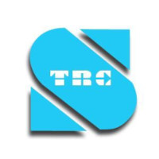
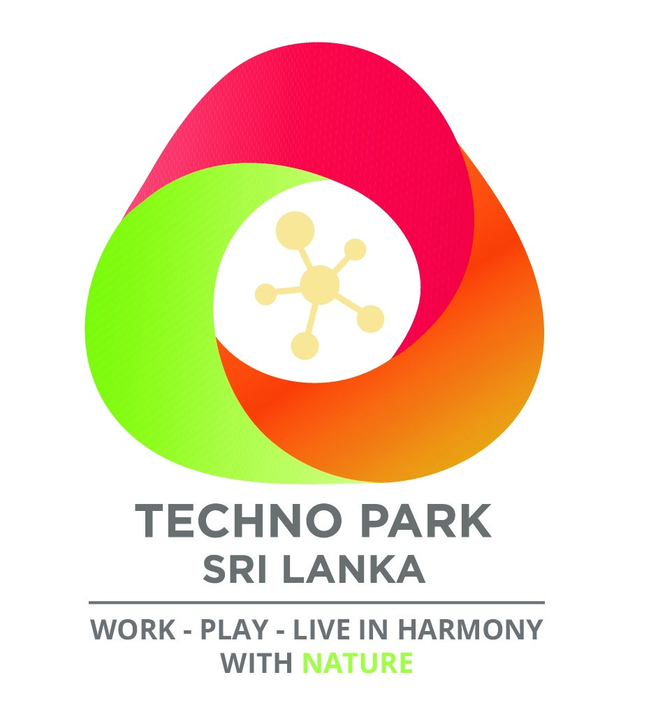

# තාක්ෂණ අමාත්‍යාංශය යටතේ ඇති ආයතන

|          [][1]          |                           [][2]                           |      [][3]      | [][4] |      [][5]      |      [][6]      |
| :---------------------------------------------------------: | :---------------------------------------------------------------------------------------------: | :--------------------------------------------------------: | :-----------------------------------------------------: | :------------------------------------------------------: | :------------------------------------------------------: |
| [**පුද්ගලයන් ලියාපදිංචි කිරීමේ දෙපාර්තමේන්තුව (DRP)**](./DRP) | [**ශ්‍රී ලංකා තොරතුරු හා සන්නිවේදන තාක්ෂණ නියෝජිතායතනය  (ICTA)**](./ICTA) | [**ශ්‍රී ලංකා පරිගණක හදිසි ප්‍රතිචාර ඒකකය  (SLCERT)**](./SLCERT) |               [**ශ්‍රී ලංකා ටෙලිකොම් පීඑල්සී(SLTMobitel)**](./SLTMobitel)              | [**ශ්‍රී ලංකා විදුලි සංදේශ නියාමන කොමිෂන් සභාව (TRCSL)**](./TRCSL) | [**තාක්ෂණික උද්‍යාන සංවර්ධන පුද්ගලික සමාගම(TECHNOPARK).**](./TechnoPark) |

[1]: ./DRP
[2]: ./ICTA
[3]: ./SLCERT
[4]: ./SLTMobitel
[5]: ./TRCSL
[6]: ./TechnoPark
