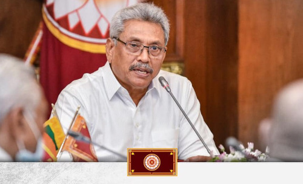
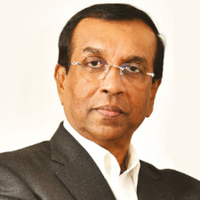
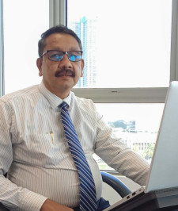
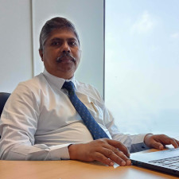
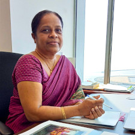
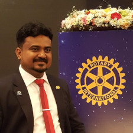
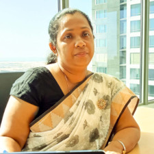

# பதவியணியினர்

## தொழில்நுட்ப அமைச்சர்

 
**அதிமேதகு சனாதிபதி, கோத்தாபய ராஜபக்ஷ**  
இலங்கை சனநாயக சோசலிசக் குடியரசின் 7 ஆவது நிறைவேற்று அதிகாரம் பெற்ற சனாதிபதி

## செயலாளர்

 
**ஜெயந்த டி சில்வா** 
செயலாளர் - தொழில்நுட்ப அமைச்சர் 
செயலாளர் - மாநில டிஜிட்டல் தொழில்நுட்பம் மற்றும் தொழில் முனைவோர் மேம்பாட்டு அமைச்சகம்

## மேலதிக செயலாளர்கள்

|                                      |                                        |
| :-----------------------------------------------------------------------: | :-------------------------------------------------------------------------: |
| **திரு. எம்.சீ.எல். ரொட்ரிகோ**    மேலதிக செயலாளர் (அபிவிருத்தி) | **திரு. ஏ.கே.ஆர். அலவத்த**  மேலதிக செயலாளர் (நிருவாகம்) |

 

## பிரதான அலுவலர்கள்

|    |   |    |    |
| - | - | - | - |
|  **திருமதி திலீப ரத்நாயக்க**  பிரதான நிதி அலுவலர் |  **திரு. உதயராஜன் ஆறுமுகம்**   பிரதான உள்ளக கணக்காய்வாளர் |  **திருமதி.எல்.எம்.டி. பத்மகுமாரி**  பிரதான கணக்காளர்  |  **திரு. ஹிரன்யா சமரசேக்கர**  பிரதான ஆலோசகர்   ICTA இல் முன்னாள் CTO  |

## நிருவாக மற்றும் முகாமைக் குழு

 
**திருமதி. ஆர்.ஏ.எஸ்.ஐ. ராஜபக்ஷ** 
கணக்காளர் 