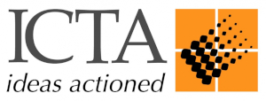

# இலங்கை தகவல் மற்றும் தொடர்பாடல் தொழில்நுட்ப முகவரகம் (ICTA)

- இலங்கையின் தகவல் மற்றும் தொடர்பாடல் தொழில்நுட் முகவகரம் (ICTA) அரசாங்கத்தின் பிரதான தகவல் மற்றும் தொடர்பாடல் தொழில்நுட்ப நிறுவனமாக காணப்படுகின்றது.  2008 ஆம் ஆண்டின் 33 ஆம் இலக்க சட்டத்தின் மூலம் திருத்தப்பட்டவாறான 2003 ஆம் ஆண்டின் 27 ஆம் இலக்க தகவல் மற்றும் தொடர்பாடல் தொழில்நுட்ப சட்டத்தின் பிரகாரம், தகவல் தொடர்பாடல் தொழில்நுட்பம் (ICT Act) தொடர்பான செயற்பாட்டுத் திட்டம் மற்றும் அரசாங்கத்தின் கொள்கையை அமுல்படுத்துவதற்கு சகல தேவையான முன்னெடுப்புக்களை தகவல் தொடர்பாடல் தொழில்நுட்ப முகவரகம் சட்டப்படி அதிகாரம் வழங்கப்பட்டுள்ளது. 

- தகவல் தொடர்பாடல் தொழில்நுட்பச் சட்டத்தின் 6 ஆம் பிரிவின் பிரகாரம், தகவல் தொடர்பாடல் தொழில்நுட்பம் தொடர்பான தேசிய கொள்கை உருவாக்கத்திற்கு அமைசரவைக்கு உதவி புரிவதற்கு தகவல் தொடர்பாடல் தொழில்நுட்ப முகவரகம் தேவைப்படுத்தப்பட்டுள்ளது. தகவல் தொடர்பாடல் தொழில்நுட்ப முகவரகம் இலங்கை அரசாங்தக்தின் முழுமையான உரிமை கொண்ட நிறுவனமாக இருப்பதுடன் 2004 – 2011 ஆண்டு வரை உலக வங்கியினால் நிதியளிப்புச் செய்யப்பட்ட இ - இலங்கை அபிவிருத்தி செயற்திட்டத்தினை அமுல்படுத்துவதற்கு உருவாக்கப்பட்டு செயற்படுத்தப்பட்டு வருகின்றது. இ- இலங்கை அபிவிருத்தி செயற்திட்டத்தின் ஊடாக, இலங்கையின் பொருளாதரத்தை அபிவிருத்தி செய்வதற்கும், வறுமையைக் குறைப்பதற்கும் மற்றும் இலங்கை மக்களின் வாழ்க்கைத் தரத்தை மேம்படுத்துவதற்கும் தகவல் தொடர்பாடல் தொழில்நுட்பம் பயன்படுத்தப்படும். எனினும், தகவல் தொடர்பாடல் தொழில்நுட்ப முகவரகத்தினால் நாட்டில் மற்றும் அதன் சமூகத்தில் மேற்கொள்ளப்பட்ட குறிப்பிடத்தகு முன்னேற்றத்தின் காரணமாக, அரசாங்கம் அதன் முக்கியத்துவத்தை உணர்ந்ததுடன் தகவல் தொடர்பாடல் தொழில்நுட்ப முகவரகத்தின் நிரந்தர நிலைத்திருப்பின் தேவையையும் அரசாங்கம் உணர்ந்து 2003 ஆம் ஆண்டின் தகவல் தொடர்பாடல் தொழில்நுட்ப இறுதி வாசகம் 2008 ஆம் ஆண்டில் திருத்தம் செய்யப்பட்டது.

- தகவல் தொழில்நுட்பத்தை அறிவு பரிமாற்ற கருவியாக பயன்படுத்தி டிஜிட்டல் ஆளுகையை விரிவுபடுத்துதல்; சர்வதேச இ-காமர்ஸ் மற்றும் மின்-கட்டண அமைப்புகளை நிறுவுதல் மற்றும் புதிய சட்டங்கள் மற்றும் நிறுவன கட்டமைப்புகளை வடிவமைத்தல் தரவு பாதுகாப்பு, சைபர் பாதுகாப்பு மற்றும் அறிவுசார் சொத்துரிமைகள் போன்ற சந்தை செயல்முறைகள் மற்றும் மாநில பொறிமுறையை எளிதாக்குவதன் மூலம் திறமையான மற்றும் குடிமக்களை மையப்படுத்திய சேவைகளை வழங்குவது உட்பட தேசிய முன்னுரிமைகளுக்கான தேசிய அளவிலான வழிகாட்டுதல் மற்றும் ஒருங்கிணைப்பை வழங்குவதற்கான உயர்மட்ட நிறுவனமாக தற்போது தகவல் தொடர்பாடல் தொழில்நுட்ப முகவரகம் (ICTA) செயற்படுகின்றது. 

- இந்த வலுவான நிர்வாக அமைப்புடன், தற்போது தகவல் தொடர்பாடல் தொழில்நுட்ப முகவரகம் (ICTA) ஆனது  அரச துறை, தனியார் துறை, அரசு சாரா மற்றும் கல்விப் பின்புலம் கொண்ட அனுபவம் வாய்ந்த நிபுணர்களைக் கொண்டுள்ளது, அவர்கள் முகாமையாளர்கள், ஆலோசகர்கள் மற்றும் தொழில்வல்லுநர்கள் என ஒன்றிணைந்து, தகவல் தொடர்பாடல் தொழில்நுட்பம் (ICT) செயலாக்கத்தின் மூலம் தேசத்தின் வளர்ச்சியை ஊக்கப்படுத்த உதவுகிறார்கள். 

- இணையதளம்: https://www.icta.lk
