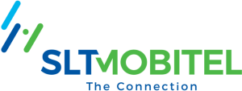

# சிறி லங்கா டொலிகொம் பிஎல்சி  (SLTMobitel)

இலங்கை டெலிகொம் (SLT) தேசிய தகவல் மற்றும் தொடர்பாடல் தொழில்நுட்ப தீர்வு வழங்குநராக இருப்பதுடன் முன்னணி புரேட் பேண்ட் மற்றும் பிரதான உட்கட்டமைப்பு  சேவை வழங்குநராகவும் இருக்கின்றது. 163 வருடங்களுக்கு மேலாக, நிலையான, கையடக்க, மற்றும் பிற தொழிற்பாட்டு துண்டங்கள் தொடர்பான இணைப்பு, தொழிற்பாடு தொடர்பாக நாட்டின் தேவை தொடர்பாக கம்பனி சேவையாற்றுகின்றது. 
இலங்கை டெலிகொம் (SLT)  ஆனது அதன் அதிவேக இழை, செப்பு மற்றும் வயர்களற்ற பிரவேசிப்பு வலையமைப்பு மூலம் நாட்டின் உள்ள ஒன்பது மில்லியனுக்கும் அதிகமான வாடிக்கையாளர்களின் தேவைகளை பூர்த்தி செய்கிறது. டிஜிட்டல் சேவை வழங்குநராக நிறுவனத்தின் நிலைமாற்ற தொலைத்தொடர்பு சேவைகளுக்கு அப்பால் செல்லவும், டிஜிட்டல் வாழ்க்கை முறைக்கு ஏற்ற பல்வேறு சேவைகள் மற்றும் தீர்வுகளை வழங்கவும் உதவியுள்ளது. சர்வதேச நீர்மூழ்கிக் கப்பல் கேபிள் முறைமையின் மூலம் இலங்கையை உலகத்துடன் இணைப்பதன் மூலம் SLT ஒரு முக்கிய உலகளாவிய பங்காளியாக நிலைநிறுத்தப்பட்டுள்ளது. 

## பிரதான தொழில்முயற்சி மார்க்கங்கள்

ஸ்ரீலங்கா டெலிகொம் (“SLT”) குழுவானது அதன் பல்வேறுபட்ட வாடிக்கையாளர் தளத்திற்கு சமீபத்திய தொழில்நுட்பங்கள் மூலம் பல்வகைப்பட்ட சேவைகள் மற்றும் பரந்த அளவிலான ICT தீர்வுகளை வழங்குகிறது. இவை நிலையான மற்றும் மொபைல் தொலைபேசி, பிராட்பேண்ட், தரவு சேவைகள், இணைய நெறிமுறை தொலைக்காட்சி (IPTV), கிளவுட் கம்ப்யூட்டிங் மற்றும் ஹோஸ்டிங் சேவைகள் மற்றும் நெட்வொர்க்கிங் தீர்வுகளை உள்ளடக்கியது. ஸ்ரீலங்கா டெலிகொம் (“SLT”)  இன் முதன்மை மூலோபாயப் பிரிவுகளாவன: 

- நிலையான தகவல் தொடர்பாடல் தொழில்நுட்ப தொழிற்பாடுகள் 
- கையடக்க தொலைபேசி தகவல் தொடர்பாடல் தொழில்நுட்ப தொழிற்பாடுகள்
- பிற துண்ட தொழிற்பாடுகள்

நிலையான மற்றும் கையடக்க தகவல் தொடர்பாடல் தொழில்நுட்ப தொழிற்பாடுகள் பிரதான தொழில்முயற்சியை உள்ளடக்குவதுடன், கூட்டாக 98% சதவீத வருவாயிற்கும், 98% சதவீத மொத்த சொத்துக்களுக்கும் மற்றும் 97% சதவீத மூலதன செலவீனங்களுக்கும் 2020 ஆம் ஆண்டில் இலங்கை டெலிகொம் (SLT)  உரிமை கோருகின்றது. 

## நிலையான தகவல் தொடர்பாடல் தொழில்நுட்ப தொழிற்பாடுகள் 

டிஜிட்டல் சேவை வழங்குநராக நிலைமாற்றமடையும் அதன் பயணத்தில், சிறிலங்கா டொலிகொம் (SLT) அதன் முக்கிய பலம், நிபுணத்துவம் மற்றும் சொத்துக்களைப் பயன்படுத்தும் தயாரிப்புகள் மற்றும் சேவைகளை வழங்குவதற்கு தகவல் தொடர்பாடல் தொழில்நுட்பம் (ICT) சேவைகளுக்கு அப்பால் விரிவடைந்துள்ளது. சிறிலங்கா டொலிகொம் (SLT) அதன் துணை நிறுவனங்கள் மூலம் பின்வரும் சேவைகளை வழங்குகிறது:

- IPTV சேவைகள் மற்றும் உள்ளடக்கத்தை உருவாக்கும் வசதிகள்
- மனித வள தீர்வுகள்
- தகவல் தொடர்பாடல் தொழில்நுட்ப உட்கட்டமைப்பு மற்றும் கணினி ஒருங்கிணைப்பு தீர்வுகள்.
- அடைவு சேவைகள்
- டிஜிட்டல் சந்தைப்படுத்தல் தீர்வுகள்
- மூன்றாம் நிலை கல்வி சேவைகள்
- சுகாதார பராமரிப்புச்  சேனலிங் தளம்
- நீர்மூழ்கிக் கப்பல் கேபிள் பராமரிப்பு
- மென்பொருள் தீர்வுகள்

குழுமத்தின் வருமான நீரோட்டங்கள் மற்றும் பதவிநிலைகளை பல்வகைப்படுத்துவதுடன், நாடு மற்றும் இலங்கை மக்களின் அடிப்படைத் திறன்களைக் கட்டியெழுப்பவும், தொலைத்தொடர்புத் துறையில் உலகளாவிய பங்காளராக இலங்கையின் பிம்பத்தை உயர்த்தவும் நிறுவனம் முயல்கிறது.

இணையதளம்: https://www.slt.lk