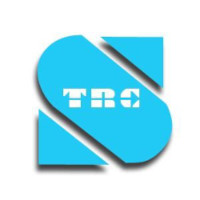

# இலங்கை தொலைத்தொடர்புகள் ஒழுங்குபடுத்தல் ஆணைக்குழு (TRCSL)

இலங்கை தொலைத்தொடர்புகள் ஒழுங்குபடுத்தல் ஆணைக்குழு (TRCSL) 1996 ஆம் ஆண்டின் 27 ஆம் இலக்க இலங்கை தொலைத்தொடர்பு (திருத்தம்) சட்டத்தின் கீழ் ஸ்தாபிக்கப்பட்டது. இலங்கையில் தொலைத்தொடர்புக்கான தேசிய ஒழுங்குமுறை நிறுவனமாக நாங்கள் செயல்முறை, பொது நலன்களைப் பாதுகாத்தல் மற்றும் பெருகிய முறையில் போட்டியிடும் சந்தையில் சவால்களுக்குப் பதிலளிக்கும் தன்மை தொடர்பாக ஒழுங்குமுறைப்படுத்தலை வடிவமைப்பதன் மூலம் தொலைத்தொடர்பு துறையில் நிலையான வளர்ச்சியை மேம்படுத்துவோம். சந்தையில் போட்டி வெளிப்படையாகவும், நியாயமாகவும், பயனுள்ளதாகவும் இருப்பதை இலங்கை தொலைத்தொடர்புகள் ஒழுங்குபடுத்தல் ஆணைக்குழு (TRCSL) உறுதி செய்யும்.

இணையதளம்:  https://www.trc.gov.lk/
