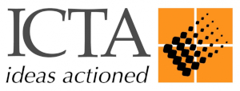
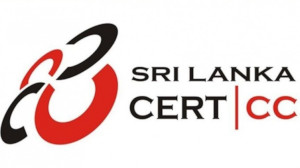
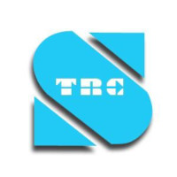

# எமது நிறுவனங்கள்

|          [][1]          |                           [][2]                           |      [][3]      | [][4] |      [][5]      |
| :---------------------------------------------------------: | :---------------------------------------------------------------------------------------------: | :--------------------------------------------------------: | :-----------------------------------------------------: | :------------------------------------------------------: |
| [**ஆட்களைப் பகுதி செய்தல் திணைக்களம் (DRP)**](./DRP) | [**இலங்கை தகவல் மற்றும் தொடர்பாடல் தொழில்நுட்ப முகவரகம் (ICTA)**](./ICTA) | [**இலங்கை கணனி அவசரநிலை ஆயத்தக் குழு (SLCERT)**](./SLCERT) |               [**சிறி லங்கா டொலிகொம் பிஎல்சி (SLT)**](./SLTMobitel)              | [**இலங்கை தொலைத்தொடர்புகள் ஒழுங்குபடுத்தல் ஆணைக்குழு (TRCSL)**](./TRCSL) |

[1]: ./DRP
[2]: ./ICTA
[3]: ./SLCERT
[4]: ./SLTMobitel
[5]: ./TRCSL
